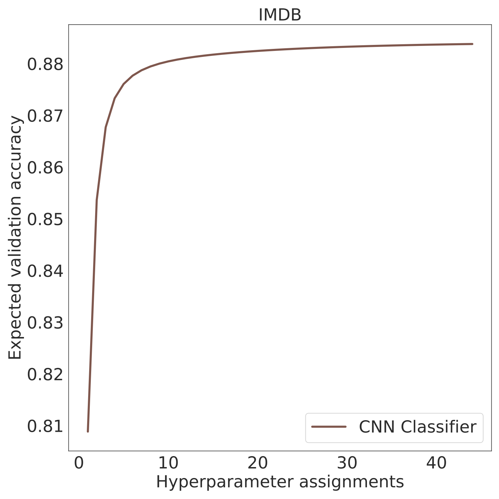

# Allentune

*Hyperparameter Search for AllenNLP*

## Citation

If you use this repository for your research, please cite:

```bibtex
@inproceedings{showyourwork,
 author = {Jesse Dodge and Suchin Gururangan and Dallas Card and Roy Schwartz and Noah A. Smith},
 title = {Show Your Work: Improved Reporting of Experimental Results},
 year = {2019},
 booktitle = {Proceedings of EMNLP},
}
```

**NOTE**: This repository works with allennlp 1.0.0. 


## Generating expected validation curves

If you are interested in plotting expected validation curves without using AllenTune, we've extracted the code for plotting here: https://github.com/dodgejesse/show_your_work

## Using AllenTune

Run distributed, parallel hyperparameter search on GPUs or CPUs. See the [associated paper](https://arxiv.org/abs/1909.03004).

This library was inspired by [tuna](https://github.com/ChristophAlt/tuna), thanks to @ChristophAlt for the work!

To get started, clone the `allentune` repository, cd into root folder, and run `pip install --editable .`s  

Then, make sure all tests pass: 

```bash
pytest -v .
```

Now you can test your installation by running `allentune -h`.

## What does Allentune support?

This library is compatible with random and grid search algorithms via Raytune. Support for complex search schedulers (e.g. Hyperband, Median Stopping Rule, Population Based Training) is on the roadmap.

## How does it work?

Allentune operates by combining a `search_space` with an AllenNLP training config. The `search_space` contains sampling strategies and bounds per hyperparameter. For each assignment, AllenTune sets the sampled hyperparameter values as environment variables and kicks off a job. The jobs are queued up and executed on a GPU/CPU when available. You can specify which and how many GPUs/CPUs you'd like AllenTune to use when doing hyperparameter search.

## Setup base training config

See `examples/classifier.jsonnet` as an example of a CNN-based classifier on the IMDB dataset. Crucially, the AllenNLP training config sets each hyperparameter value with the standard format `std.extVar(HYPERPARAMETER_NAME)`, which allows jsonnet to instantiate the value with an environment variable.

## Setup the Search space

See `examples/search_space.json` as an example of search bounds applied to each hyperparameter of the CNN classifier.

There are a few sampling strategies currently supported:

1. `choice`: choose an element in a specified set.
2. `integer`: choose a random integer within the specified bounds.
3. `uniform`: choose a random float using the uniform distribution within the specified bounds.
4. `loguniform`: choose a random float using the loguniform distribution within the specified bounds.

If you want to fix a particular hyperparameter, just set it as a constant in the search space file.

## Run Hyperparameter Search

Example command for 30 samples of random search with a CNN classifier, on 4 GPUs:

```bash
allentune search \
    --experiment-name classifier_search \
    --num-cpus 56 \
    --num-gpus 4 \
    --cpus-per-trial 1 \
    --gpus-per-trial 1 \
    --search-space examples/search_space.json \
    --num-samples 30 \
    --base-config examples/classifier.jsonnet
```

To restrict the GPUs you run on, run the above command with `CUDA_VISIBLE_DEVICES=xxx`.

**Note**: You can add the `--include-package XXX` flag when using allentune on your custom library, just like you would with allennlp.


## Search output

By default, allentune logs all search trials to a `logs/` directory in your current directory. Each trial gets its own directory. 

## Generate a report from the search

To check progress on your search, or to check results when your search has completed, run `allentune report`. 

This command will generate a dataset of resulting hyperparameter assignments and training metrics, for further analysis:

```bash
allentune report \
    --log-dir logs/classifier_search/ \
    --performance-metric best_validation_accuracy \
    --model cnn
```

This command will create a file `results.jsonl` in `logs/classifier_search`. Each line has the hyperparameter assignments and resulting training metrics from each experiment of your search.

`allentune report` will also tell you the currently best performing model, and the path to its serialization directory.

## Plot expected performance

Finally, you can plot expected performance as a function of hyperparameter assignments or training duration. For more information on how this plot is generated, check the [associated paper](https://arxiv.org/abs/1909.03004).

```bash
allentune plot \
    --data-name IMDB \
    --subplot 1 1 \
    --figsize 10 10 \
    --result-file logs/classifier_search/results.jsonl \
    --output-file classifier_performance.pdf \
    --performance-metric-field best_validation_accuracy \
    --performance-metric accuracy
```

<div style="text-align:center"> </div>

Sample more hyperparameters until this curve converges to some expected validation performance!
